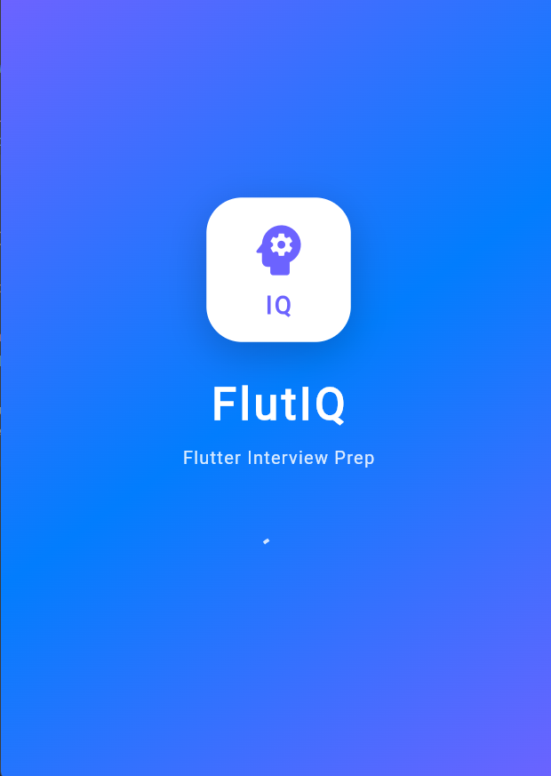
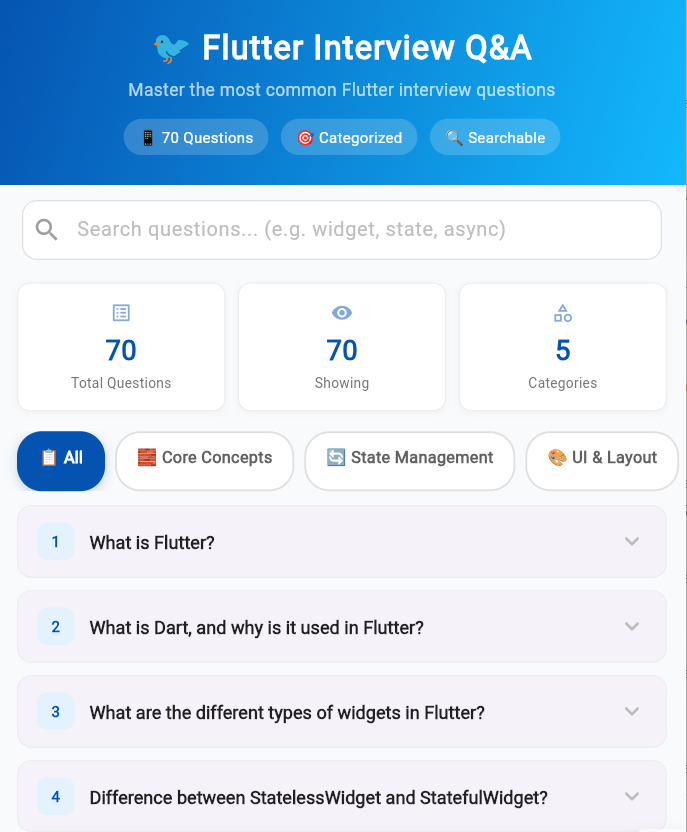
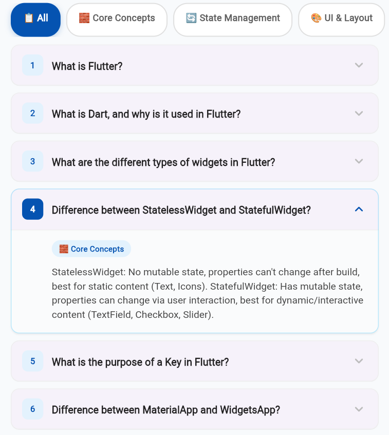

 # FlutIQ 🎯

> **Your Flutter & Dart Interview Preparation App**
> Built with ❤️ using Flutter + Provider (MVC Architecture)

<p align="center">
  
  
  
  
  
</p>

---

## 📱 Project Overview

**FlutIQ** is a Flutter-powered Q&A application designed to make interview preparation easy and effective for Flutter developers.

It features **20+ interview questions** covering Flutter, Dart, State Management, Widgets, and advanced topics. The questions are organized by category, searchable, and presented in an **expand-on-tap** format for a smooth and user-friendly learning experience.

 

> *"Interview prep, one tap at a time"*

---

## ✨ Features

| Feature | Description |
|---|---|
| 🔍 **Smart Search** | Real-time search across questions, answers, and categories |
| 🏷️ **Category Filtering** | Filter questions by topic (Flutter Basics, Dart, State Management, etc.) |
| 📂 **Expandable Q&A Cards** | Tap to expand/collapse answers with smooth animations |
| 📊 **Live Stats** | Real-time count of total, filtered, and expanded questions |
| 🎬 **Animated Splash Screen** | Professional intro with logo animation, gradient background, and fade transitions |
| 🌓 **Clean Architecture** | MVC pattern with separate Model, View, Controller layers |
| 📱 **Responsive UI** | Works smoothly on all Android screen sizes |
| ⚡ **Fast Performance** | Pure Dart logic, no heavy dependencies |
| 🎨 **Modern Design** | Gradient header, animated category chips, accordion cards |
 

### 🎯 Special Features

- **Multiple Expansion Support** — Expand one or multiple Q&A cards simultaneously
- **Clear Search One-Tap** — Instantly reset search with clear button
- **Auto-collapse on Category Change** — Clean slate when switching categories
- **Empty State UI** — Friendly message when no results found with reset option
- **Footer Attribution** — Built-in footer for app branding

---

## 🛠️ Tech Stack

```
Frontend
├── Flutter 3.x              — UI Framework
├── Dart 3.x                 — Programming Language
├── Provider                 — State Management
└── Material Design 3        — Design System

Architecture
├── MVC Pattern              — Clean separation of concerns
├── Model Layer              — Data classes + Repository (business logic)
├── View Layer               — Screens + Widgets (UI only)
└── Controller Layer         — ChangeNotifier (state bridge)

Tools
├── Android Studio / VS Code — IDE
├── Flutter CLI              — Build tools
└── Git + GitHub             — Version control
```

| Package | Version | Purpose |
|---|---|---|
| `flutter` | SDK `>=3.0.0` | Core framework |
| `provider` | `^6.1.0` | State management |
| `flutter_lints` | `^3.0.0` | Code quality |
| `flutter_test` | SDK | Testing |

---

## 📂 Folder Structure (MVC)

```
lib/
│
├── main.dart                         # 🎬 App entry point + Provider setup
│
├── models/                           # 🔵 MODEL LAYER
│   ├── question_model.dart           #   Question data class (id, question, answer, category)
│   └── question_repository.dart      #   Data source + search/filter/Stats business logic
│
├── views/                            # 🟢 VIEW LAYER (UI — No business logic)
│   ├── screens/
│   │   ├── splash_screen.dart        #   Animated intro screen (2.5s auto-navigation)
│   │   └── home_screen.dart          #   Main Q&A screen (CustomScrollView + Slivers)
│   └── widgets/
│       ├── app_header.dart           #   Gradient header with title + question count
│       ├── search_bar.dart           #   Search input with clear button
│       ├── stats_row.dart            #   Stats cards (total, showing, expanded)
│       ├── category_tabs.dart        #   Horizontal scrollable category filter chips
│       └── qa_card.dart              #   Expandable accordion Q&A card widget
│
├── controllers/                      # 🟠 CONTROLLER LAYER
│   └── home_controller.dart          #   ChangeNotifier — state + actions bridge
│
├── data/
│   └── questions_data.dart           #   Static Q&A data (100+ questions)
│
└── constants/
    └── app_constants.dart            #   Colors, strings, dimensions, theme constants
```
---
## 📸 Screenshots

### Splash Screen



### Home Screen
<p align="center">
  
  
</p>
 
 
 
### 📱 App Flow Diagram

```
┌─────────────────┐
│   Splash Screen  │  (2.5s animated)
│   💡 FlutIQ      │
└────────┬────────┘
         │ fade transition
         ▼
┌─────────────────┐
│   Home Screen    │
│                  │
│  🔍 Search       │
│  📊 Stats        │
│  🏷️ Categories   │
│  📝 Q&A Cards    │
│     ↓ tap        │
│  Expand Answer   │
└─────────────────┘
```

---

## 🚀 Installation Steps

### Prerequisites

- Flutter SDK `>=3.0.0`
- Dart SDK `>=3.0.0`
- Android Studio / VS Code with Flutter extensions

### Step 1 — Clone the Repository

```bash
git clone https://github.com/YOUR_USERNAME/flutiq.git
cd flutiq
```

### Step 2 — Install Dependencies

```bash
flutter pub get
```

### Step 3 — Run the App

```bash
# For debug mode
flutter run

# For release mode (recommended for testing performance)
flutter run --release

# For specific device
flutter run -d android        # Android
flutter run -d chrome         # Web
flutter run -d windows        # Windows
```

### Step 4 — Build APK (Production)

```bash
# Debug APK
flutter build apk --debug

# Release APK
flutter build apk --release

# Bundle for Play Store
flutter build appbundle --release
```

The APK will be at:
```
build/app/outputs/flutter-apk/app-release.apk
```

 
 ---

## 👨‍💻 Author

<div align="center">

### **[BHUPENDER]**

> Flutter Developer | Building meaningful apps 🚀

[]([https://github.com/YOUR_USERNAME](https://github.com/bhupender1208/Flutter_QA_App))
[]([https://linkedin.com/in/YOUR_USERNAME](https://www.linkedin.com/in/bhupender-00b134282?utm_source=share_via&utm_content=profile&utm_medium=member_android)) 
[](mailto:bhupender00012@gmail.com)

</div>

---

 ## ⭐ Show Your Support

> If this project helped you in your interview prep, give it a ⭐!

```
Your support motivates me to build more open-source Flutter projects.
```

---

<div align="center">

**Built with ❤️ using Flutter** | **MVC Architecture** | **FlutIQ v1.0.0**

</div>
